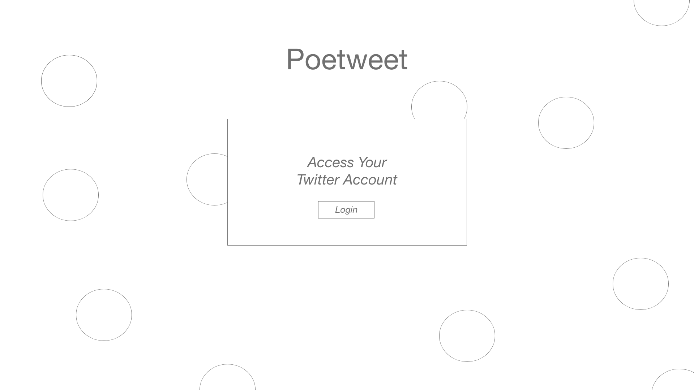
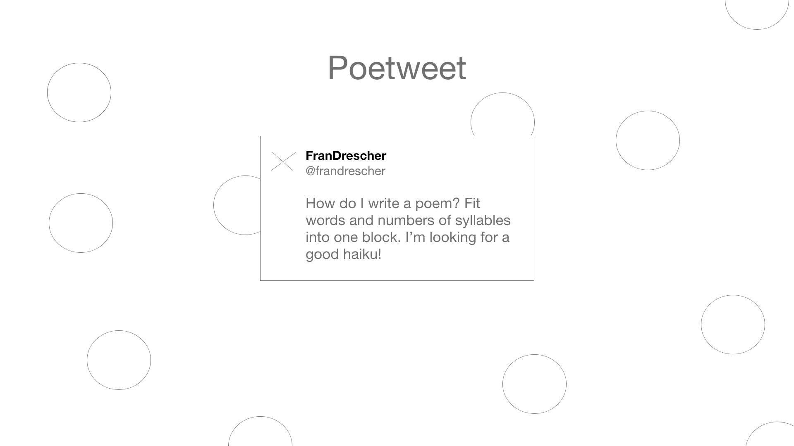
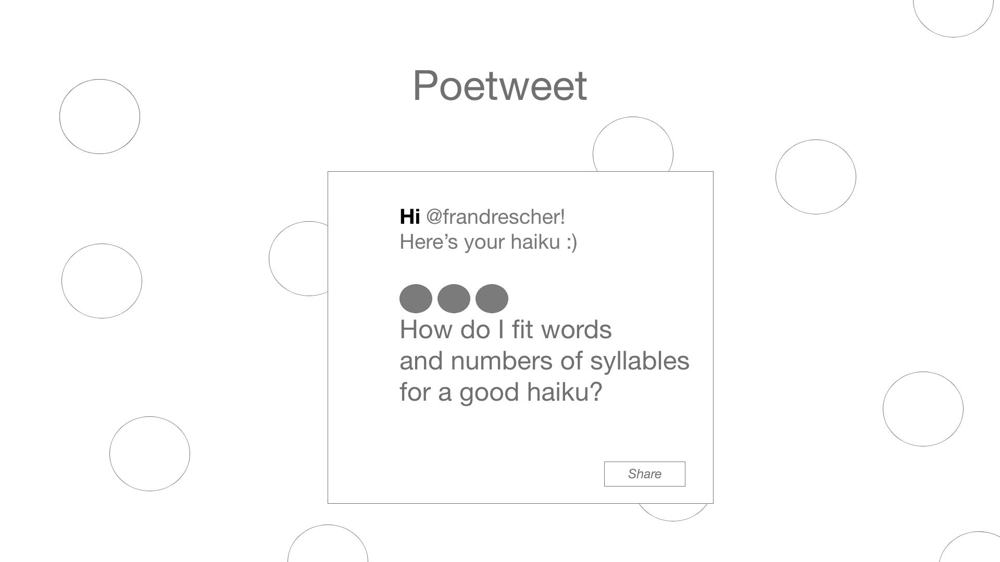

 # Project 2
 UT Austin Coding Bootcamp \
 Project Team: Emily Lorraine, Ezequiel Calderon \
 Est. Project Launch - December 11, 2018
 
 # Project Proposal

 **Poetweet**
 *Turning your tweets into poems since 2018*
 We are building an app that will help people learn about and conquer poetry. Using a user's existing Tweets or someone else's (only if public),
 the app will reformat the tweet into a haiku, sonnnet, or even mad lib. The newly created poem will then be fed to a feed
 where others will be able to read and interact with the poems. 

 The challenge will be detecting syllables in words and then producing sensical (though non-sensical will be fun) statements and phrases. We will target high school and college students. 

 
 # Rough Sketch / Prototype
 
 
 

 
 # Tech Used
 node.js \
 express.js \
 handlebars.js \
 mysql \
 sequelize \
 Twitter API \
 vue.js - new tech! 
 
 # Tasks and Next Steps
 - Get proposal approved
 - Draft intial MVP features list
 - Set dev goal for Friday
